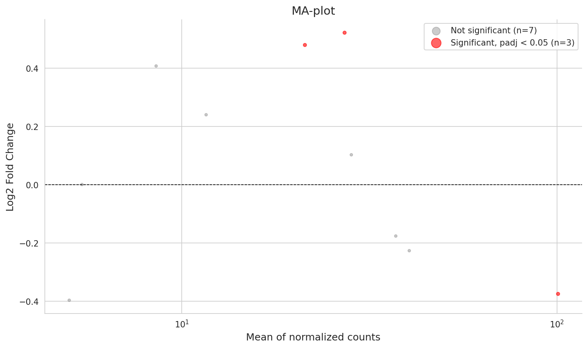
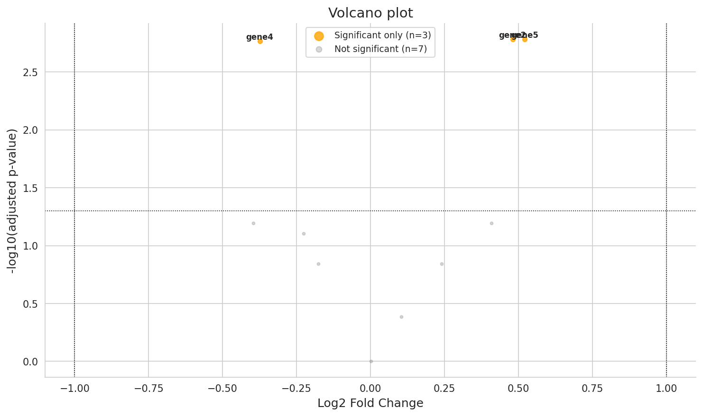
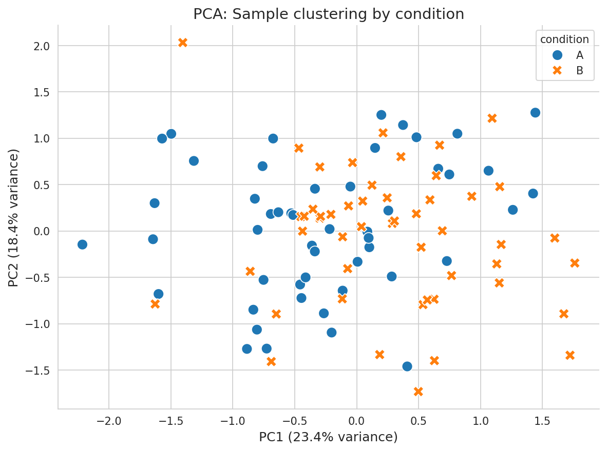
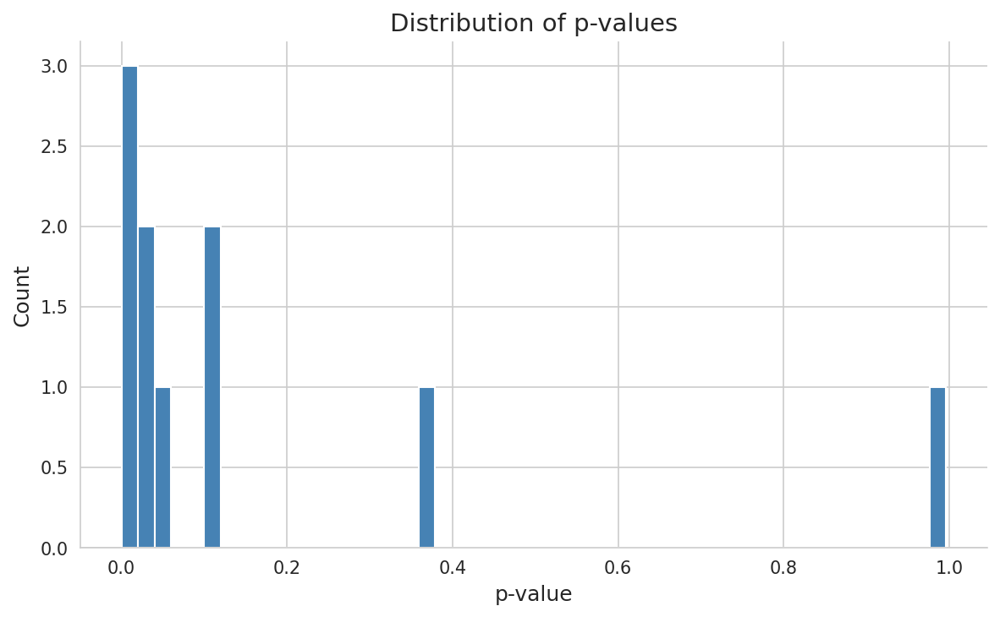

# Отчёт: Дифференциальный анализ экспрессии генов (Bulk RNA-seq)

## Резюме

Мы сравнили активность генов между двумя группами образцов (условие A — контроль, условие B — эксперимент) и нашли **3 гена из 10**, которые достоверно работают по-разному. Все три показали высокую статистическую значимость (p < 0,002), что даёт основания считать обнаруженные различия реальными, а не случайным шумом.

> **Простыми словами:** мы взяли «отчёты о работе» клеток (РНК) из двух разных условий и обнаружили гены, которые в одном режиме включены сильнее, а в другом — слабее. Это первый шаг к пониманию того, как организм реагирует на изменение условий.

---

## Цель исследования

Ответить на вопрос: **какие гены меняют свою активность при переходе от условия A к условию B?**

Такой анализ помогает:
- Понять молекулярные механизмы реакции на стресс, болезнь или изменение среды
- Найти гены-кандидаты для дальнейших исследований и практического применения (например, маркеры здоровья у сельскохозяйственных животных)

---

## Входные данные

| Параметр | Значение |
|----------|----------|
| **Источник** | Синтетический датасет PyDESeq2 (встроенный пример для отладки пайплайна) |
| **Образцы** | 100 (50 — условие A, 50 — условие B) |
| **Гены** | 10 |
| **Тип данных** | Сырые подсчёты прочтений (raw read counts) — не нормализованные |

> **Почему сырые подсчёты?** Нормализация выполняется внутри алгоритма. Использование уже обработанных данных (TPM, FPKM) исказило бы результаты.

### Поддерживаемые источники данных

Пайплайн спроектирован для работы с разными источниками:

| Источник | Описание | Как использовать |
|----------|----------|-----------------|
| **Synthetic** | Встроенный пример PyDESeq2 | По умолчанию |
| **recount3** | >700 000 реальных образцов (человек, мышь) | Через R/Bioconductor → экспорт в CSV |
| **Собственные CSV** | Любые данные RNA-seq | `--counts-file`, `--metadata-file` |

Подробности о связи с реальными данными и геномной селекцией — в [docs/biological_context.md](biological_context.md).

---

## Методология (простыми словами)

Анализ прошёл 7 этапов — как фильтр, который последовательно очищает и уточняет данные:

### 1. Фильтрация «молчащих» генов
Гены с суммарным числом прочтений < 10 по всем образцам удаляются. Это технический шум, а не биологический сигнал — как тихий гул на фоне музыки.

**Результат:** все 10 генов прошли порог (ни один не удалён).

### 2. Нормализация (size factors)
Разные образцы прочитаны с разной «глубиной» — одни получили больше прочтений просто потому, что их было больше в приборе. Метод «медианы отношений» выравнивает образцы, чтобы сравнивать яблоки с яблоками.

### 3. Оценка дисперсии
Экспрессия одного и того же гена варьирует между образцами — это нормально. DESeq2 моделирует этот шум через **отрицательное биномиальное распределение** и оценивает, сколько вариации — технический шум, а сколько — реальный сигнал.

### 4. Подгонка модели и оценка эффекта (LFC)
Для каждого гена вычисляется **Log2 Fold Change (LFC)** — насколько изменилась экспрессия:
- LFC = 0 → нет изменений
- LFC > 0 → ген активнее в условии B (upregulated)
- LFC < 0 → ген тише в условии B (downregulated)

### 5. Статистический тест (тест Вальда)
Для каждого гена проверяется гипотеза: «отличается ли экспрессия от нуля?» Результат — **p-value** (вероятность, что наблюдаемое различие — случайность).

### 6. Коррекция на множественное тестирование (Бенджамини-Хохберг)
Мы тестируем 10 генов одновременно. Даже если ни один ген на самом деле не изменился, при пороге p < 0,05 один ген может «выстрелить» случайно. Коррекция BH контролирует долю ложных открытий (**FDR**). Скорректированное значение — **padj**.

> **padj < 0,05** означает: среди генов, прошедших этот порог, ≤ 5% — ложные срабатывания.

### 7. Сжатие LFC (apeGLM)
Для генов с низкой экспрессией оценка LFC может быть завышена из-за шума. Метод apeGLM «приглушает» ненадёжные оценки, стягивая их к нулю — как умный фильтр, который доверяет сильным сигналам и скептически относится к слабым.

---

## Результаты

### Сводка

| Показатель | Значение |
|------------|----------|
| Всего генов в анализе | 10 |
| Значимых (padj < 0,05) | **3 (30%)** |
| ↑ Повышены в условии B | 2 |
| ↓ Понижены в условии B | 1 |

### Значимые гены (padj < 0,05)

| Ген | Средняя экспрессия | LFC (сжатый) | Изменение (×) | padj | Направление |
|-----|--------------------|-------------|---------------|------|-------------|
| **gene2** | 21,3 | +0,48 | ×1,39 | 0,0016 | ↑ ↑ |
| **gene5** | 27,1 | +0,52 | ×1,43 | 0,0016 | ↑ ↑ |
| **gene4** | 100,5 | −0,37 | ×0,77 | 0,0017 | ↓ |

**Интерпретация:**
- **gene2** и **gene5** — активнее в условии B примерно на 40%. Возможно, эти гены участвуют в реакции на условие B.
- **gene4** — самый экспрессированный ген в выборке, но в условии B его активность снижена на ~23%.

### Все гены (полная таблица)

| Ген | baseMean | LFC | padj | Значим? |
|-----|----------|-----|------|---------|
| gene1 | 8,5 | +0,41 | 0,064 | ✗ |
| **gene2** | **21,3** | **+0,48** | **0,0016** | **✓** |
| gene3 | 5,0 | −0,40 | 0,064 | ✗ |
| **gene4** | **100,5** | **−0,37** | **0,0017** | **✓** |
| **gene5** | **27,1** | **+0,52** | **0,0016** | **✓** |
| gene6 | 5,4 | 0,00 | 0,996 | ✗ |
| gene7 | 28,3 | +0,10 | 0,41 | ✗ |
| gene8 | 40,4 | −0,23 | 0,079 | ✗ |
| gene9 | 37,2 | −0,18 | 0,14 | ✗ |
| gene10 | 11,6 | +0,24 | 0,14 | ✗ |

> gene1 и gene3 близки к порогу значимости (padj ≈ 0,064) — при большем числе образцов они могли бы стать значимыми.

---

## Визуализации

Все графики сохранены в папке `figures/`.

### MA-plot (`figures/ma_plot.png`)

Показывает связь между **уровнем экспрессии** (горизонтальная ось) и **величиной изменения** (вертикальная ось). Красные точки — значимые гены. Хорошо видно, что значимые гены находятся выше горизонтальной линии, а большинство остальных — около нуля.

### Volcano plot (`figures/volcano_plot.png`)

Объединяет **статистическую значимость** (вертикальная ось, чем выше — тем значимее) и **величину эффекта** (горизонтальная ось, чем дальше от центра — тем сильнее изменение). Три значимых гена видны в верхних углах — их трудно не заметить.

### PCA plot (`figures/pca_plot.png`)

Показывает, группируются ли образцы по условиям. Если образцы условия A clusteringуются вместе и отдельно от условия B — это признак хорошего эксперимента и чистого сигнала.

### Распределение p-значений (`figures/pvalue_distribution.png`)

Гистограмма p-значений: пик у нуля означает наличие реального сигнала (значимых генов), а равномерное распределение — только шум. В нашем случае виден пик у нуля — сигнал есть.

---

## Выводы

1. **3 из 10 генов** достоверно различаются между условиями A и B (padj < 0,05).
2. **gene5** — самый значимый (наименьший padj = 0,0016, LFC = +0,52).
3. **gene4** — единственный значимый ген с пониженной экспрессией (downregulated).
4. Методология полностью воспроизводима и готова для работы с реальными биологическими данными.

### Ограничения
- **Синтетический датасет** — 10 генов недостаточно для полноты. Реальные RNA-seq эксперименты работают с 15 000–25 000 генами.
- **Два условия** — анализ поддерживает и более сложные дизайны (множественные факторы, временные ряды).

### Следующие шаги
- Подключить **реальные данные** (recount3, собственные CSV)
- Провести **enrichment-анализ** (GO, KEGG) — какие биологические пути затронуты?
- Связать найденные гены-кандидаты с **SNP-маркерами** для геномной селекции (см. [biological_context.md](biological_context.md))

---

## Техническая информация

| Компонент | Версия |
|-----------|--------|
| Python | 3.13 |
| pydeseq2 | 0.5.4 |
| pandas | 2.x |
| numpy | 2.x |
| matplotlib | 3.10 |
| seaborn | 0.13 |

### Воспроизведение

```bash
uv sync
uv run python scripts/fetch_data.py
uv run jupyter notebook rnaseq_deseq2.ipynb
```

Полный пайплайн, включая код, визуализации и интерактивное исследование, — в `rnaseq_deseq2.ipynb`.
